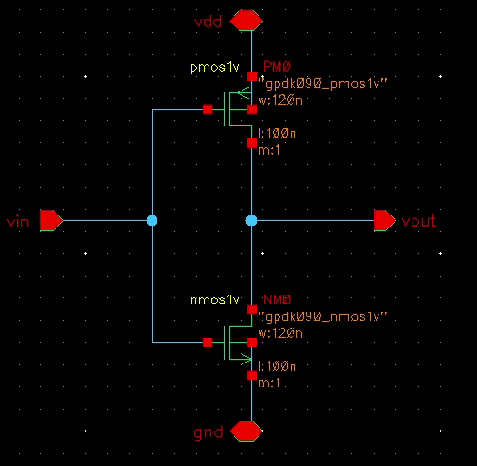
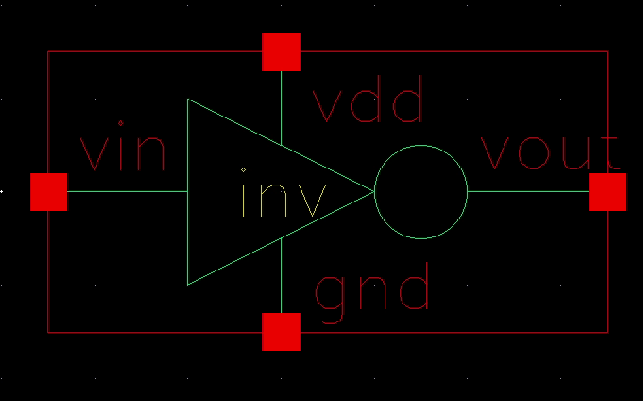
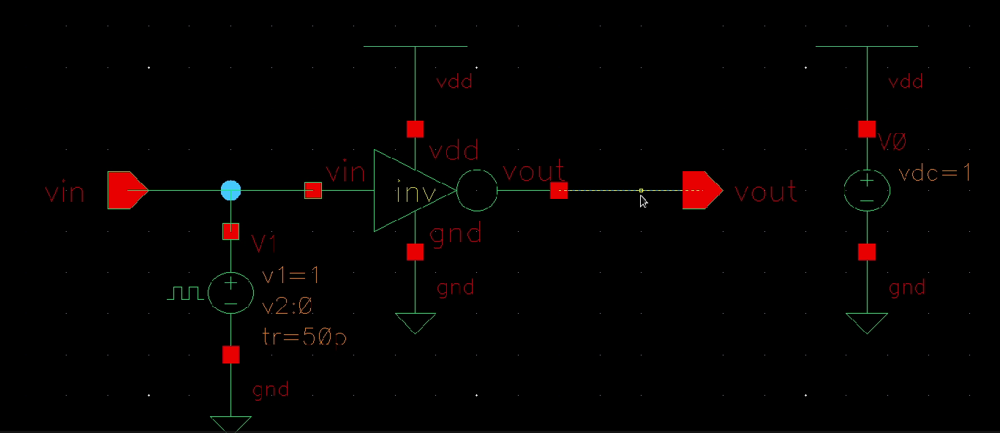
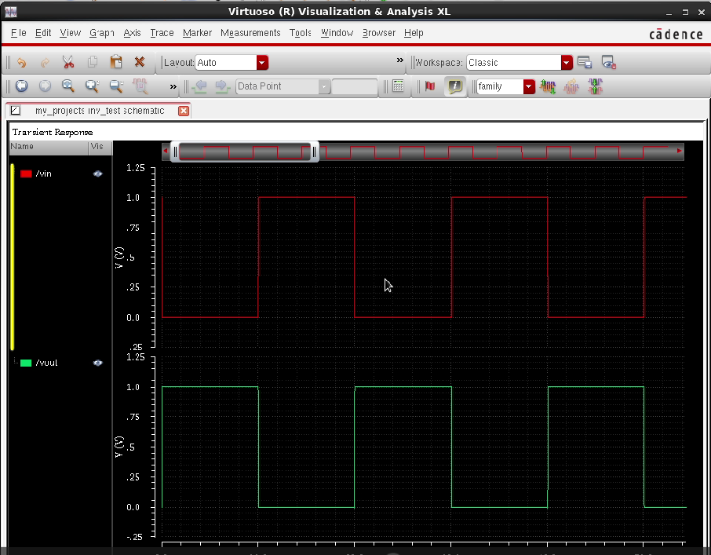
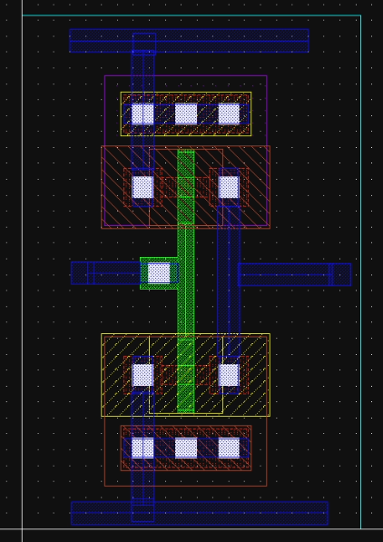
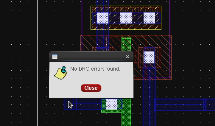
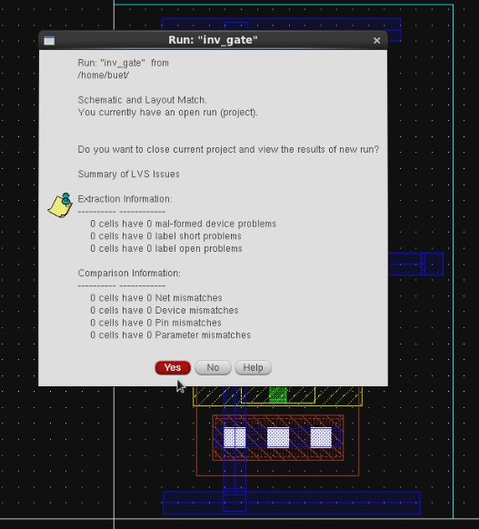
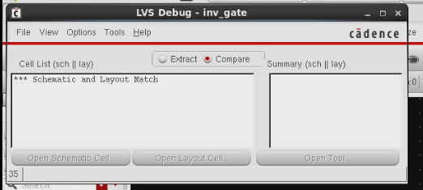
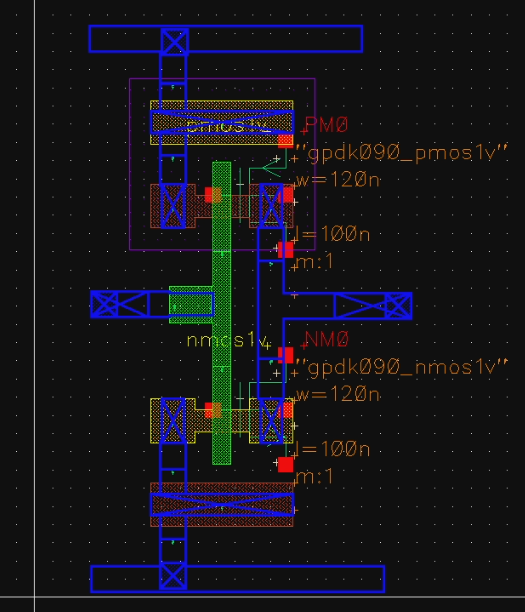

# inverter-cadence-project
CMOS NOT Gate design using Cadence Virtuoso including schematic design, simulation and layout verification (DRC, LVS REX).
# CMOS Inverter Design using Cadence Virtuoso

## Project Overview

This project demonstrates the design, simulation, and layout implementation of a CMOS inverter using Cadence Virtuoso. The CMOS inverter is one of the most fundamental building blocks in digital integrated circuits. It performs the logical NOT operation by converting a HIGH input signal to LOW output and vice versa.

The project includes schematic design, symbol creation, testbench simulation, layout design, parasitic extraction, and verification using DRC and LVS.

---

# Theory

## CMOS Technology

Complementary Metal Oxide Semiconductor (CMOS) technology is widely used in modern digital integrated circuits due to its low power consumption, high noise immunity, and high packing density. CMOS circuits use both NMOS and PMOS transistors to implement logic functions efficiently.

---

## CMOS Inverter

A CMOS inverter consists of two complementary MOSFET transistors:

PMOS transistor – connected between output and VDD
NMOS transistor – connected between output and GND

Both transistor gates are connected together to form the input node.

---

## Working Principle

### Input = LOW

When the input voltage is LOW:

* PMOS transistor turns ON
* NMOS transistor turns OFF

The output is connected to VDD.

Output = HIGH

---

### Input = HIGH

When the input voltage is HIGH:

* PMOS transistor turns OFF
* NMOS transistor turns ON

The output is connected to ground.

Output = LOW

---

## Truth Table

| Input | Output |
| ----- | ------ |
| 0     | 1      |
| 1     | 0      |

---

# Design Flow

1 Create CMOS inverter schematic
2 Generate symbol for the inverter
3 Create testbench circuit
4 Run transient simulation
5 Design layout of inverter
6 Perform DRC verification
7 Perform LVS verification
8 Perform parasitic extraction

---

# Schematic Design

The schematic consists of one PMOS transistor connected to VDD and one NMOS transistor connected to ground. Both transistor gates are connected together to form the input node, while the output is taken from the common drain node.

---

# Symbol Creation

A symbol is created for the inverter so that it can be easily used as a reusable block in higher level designs.

---

# Testbench Setup

A testbench circuit is created to apply input signals and observe the output waveform of the inverter.

---

# Transient Simulation

Transient analysis is performed to observe switching behavior of the inverter. The waveform shows that when the input is LOW the output becomes HIGH and when the input is HIGH the output becomes LOW.

---

# Layout Design

The layout of the CMOS inverter is implemented following standard CMOS layout rules. Proper placement of NMOS and PMOS transistors, metal routing, and well contacts are ensured.

---

# DRC Verification

Design Rule Check verifies that the layout follows fabrication design rules. The DRC result shows that the layout is error free.

---

# LVS Verification

Layout Versus Schematic ensures that the layout matches the schematic design.

---

# LVS Match Result

The LVS match result confirms that the layout and schematic are identical.

---

# Parasitic Extraction

After layout completion, parasitic extraction is performed to obtain resistance and capacitance values introduced by interconnects.

---

# Results

The CMOS inverter was successfully designed and verified.

* Correct inverter operation observed
* DRC Passed
* LVS Matched
* Proper switching waveform obtained

---

# Applications

CMOS inverters are widely used in:

* Digital logic circuits
* Ring oscillators
* Memory circuits
* Clock buffers
* Signal restoration circuits

---

# Author

## Abhijit Wankhede Analog Layout Engineer | VLSI Enthusiast

---
